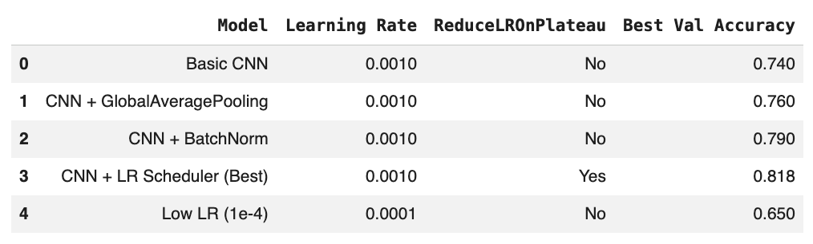
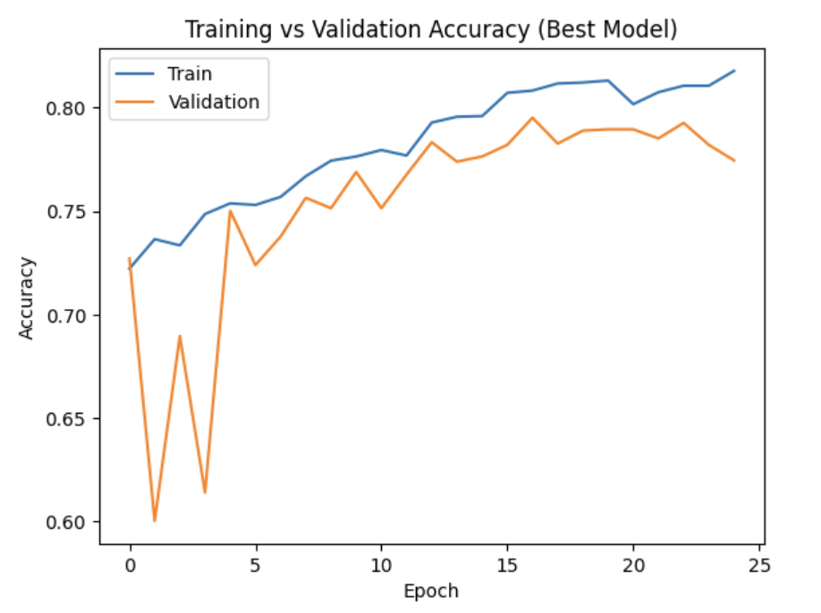
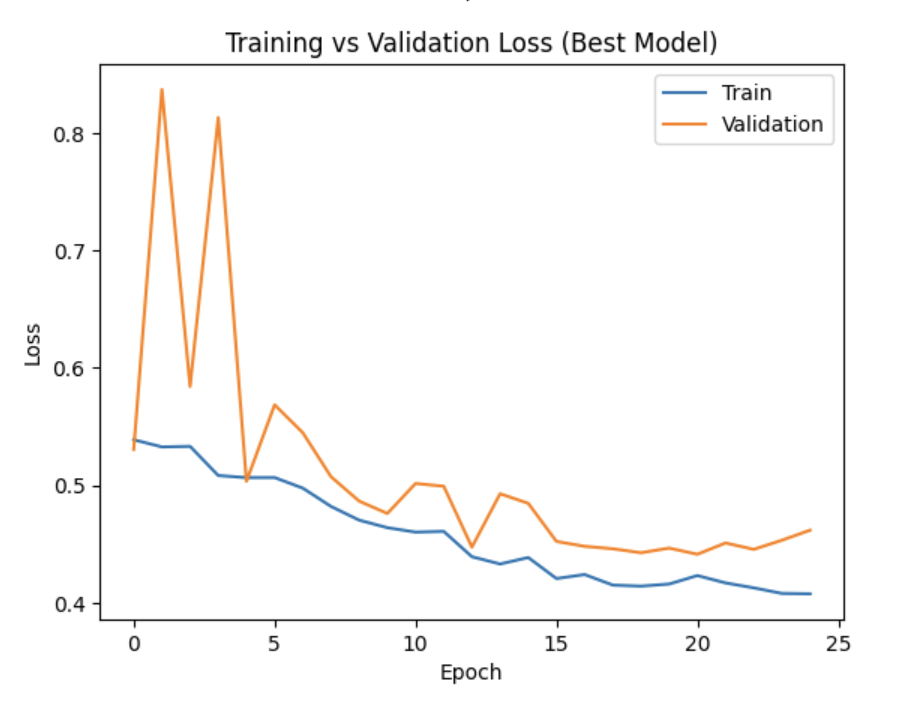
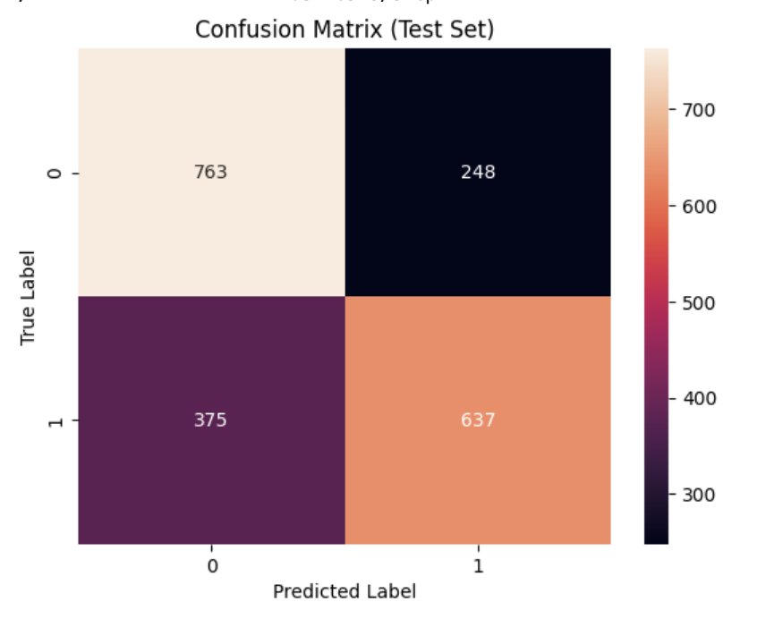

# 🐶🐱 Cats vs Dogs Görüntü Sınıflandırma Projesi (CNN)

Bu proje, **Convolutional Neural Network (CNN)** kullanarak kedi ve köpek görüntülerini sınıflandırmayı amaçlamaktadır. Projenin temel amacı yalnızca çalışan bir model üretmek değil; aynı zamanda:
* Farklı CNN mimarilerini denemek
* Eğitim stratejilerini karşılaştırmak
* Öğrenme oranı (Learning Rate) etkisini analiz etmek
* Regularization tekniklerini değerlendirmek
* Model performansını sistematik olarak karşılaştırmak olmuştur.

Bu proje, derin öğrenme model geliştirme sürecinin deneysel ve analitik yönünü göstermektedir.

---

## 📊 Veri Seti
* Problem Türü: Binary Classification
* Sınıflar:
  * 🐱 Cat
  * 🐶 Dog
* Görseller: 150x150 boyutuna yeniden ölçeklendirildi
* Veri bölünmesi:
  * Train Set
  * Validation Set
  * Test Set
* Model seçimi validation set üzerinden yapılmış, final performans test set ile ölçülmüştür.

---

## 🧠 Denenen Modeller ve Deneyler

Proje süresince farklı mimari ve eğitim stratejileri test edilmiştir.

  

---

## 🔍 Deneysel Bulgular
### 1️⃣ Basic CNN

Temel konvolüsyon katmanları ile oluşturulmuş baseline modeldir.
**%74** doğruluk ile başlangıç noktası oluşturmuştur.

### 2️⃣ GlobalAveragePooling

Fully Connected katman sayısını azaltarak parametre sayısını düşürmüştür.
Performans **%76’ya** yükselmiştir.

### 3️⃣ Batch Normalization

Daha stabil eğitim süreci sağlamış ve doğruluk **%79’a** ulaşmıştır.

### 4️⃣ ReduceLROnPlateau (En İyi Model)

Validation loss plato yaptığında öğrenme oranı düşürülmüştür.
Bu yaklaşım modelin daha stabil optimize olmasını sağlamıştır.

**🎯 En iyi validation accuracy: %81.8**

### 5️⃣ Düşük Learning Rate (1e-4)

Beklenenden düşük performans göstermiştir **(%65).**
Model underfitting davranışı sergilemiştir.

---

## 🚀 En İyi Model Yapılandırması
* Learning Rate: 0.001
* Optimizer: Adam
* Callback:
  * EarlyStopping
  * ReduceLROnPlateau
* Epoch: 25
* Görsel Boyutu: 150x150

---

## 📊 Eğitim Süreci Analizi

### 📈 Accuracy Grafiği

Training accuracy düzenli artış göstermiştir.

Validation accuracy benzer trend izlemiştir.

İlk epoch’larda dalgalanma görülmektedir.

Overfitting gözlemlenmemiştir.

ReduceLROnPlateau validation loss’un durakladığı noktada öğrenme oranını düşürerek performansı stabilize etmiştir.

  

 

### 📉 Loss Grafiği

Training loss sürekli azalmıştır.

Validation loss başlangıçta dalgalanmış, ardından stabilize olmuştur.

Train ve validation loss arasında büyük ayrışma bulunmamaktadır.

Model genelleme kabiliyetini korumuştur.

  

 

### 🧮 Confusion Matrix (Test Set)

Model iki sınıfı da dengeli şekilde öğrenmiştir.

Yanlış sınıflandırmalar sınırlıdır.

False Positive ve False Negative oranları kabul edilebilir seviyededir.

Model gerçek dünya verisinde kullanılabilir seviyede performans göstermektedir.

  

 

---

## 📌 Test Performansı

Final model test set üzerinde değerlendirilmiştir.
* Test Accuracy: ~%80 civarı
* Validation ile test sonuçları arasında ciddi sapma yoktur.
* Model genelleme başarısı yüksektir.

---

## 🎯 Sonuç
Bu proje yalnızca bir görüntü sınıflandırma çalışması değil;
aynı zamanda sistematik deney yapma ve model iyileştirme sürecinin bir örneğidir.

Farklı mimariler ve eğitim stratejileri karşılaştırılmış, en iyi model analitik olarak seçilmiş ve performansı detaylı şekilde raporlanmıştır.

**🎯 En iyi validation accuracy: %81.8**
